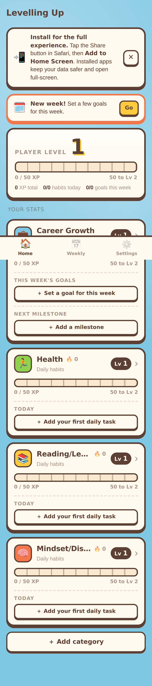

# Levelling Up

A personal self-improvement tracker with RPG stats, built as an installable
web app for iPhone. Life categories earn XP from daily check-ins and weekly
goals, level up over time, and track streaks and milestones. Single user, no
login, no backend.

First launch creates four categories with nothing in them:

| Category | Tracked by |
| --- | --- |
| Career Growth | weekly goals and milestones (no streak) |
| Health | daily habits |
| Reading/Learning | daily habits |
| Mindset/Discipline | daily habits |

Daily tasks are deliberately not pre-populated; add them as you go. Each
category can be switched between the two tracking modes from its edit
screen, and the dashboard panel changes shape to match: a daily-driven panel
shows today's checklist and streak, a goal-driven panel shows this week's
goals and progress toward the next milestone.



The full brief is in [docs/SPEC.md](docs/SPEC.md).

## Running it

There is no build step. Any static file server works:

```sh
npm run serve      # http://localhost:8080
npm test           # unit tests for XP, streak, date and backup logic
npm run icons      # regenerate the PNG icons from scripts/make-icons.js
```

The service worker only registers over HTTPS or localhost, so open it via a
server rather than `file://`.

## Installing on iPhone

1. Deploy the folder to any static host (see below) and open the URL in Safari.
2. Tap **Share**, then **Add to Home Screen**.
3. Open it from the home screen. It runs full-screen with no browser chrome,
   works offline, and the dashboard's install banner disappears.

iOS can clear a website's storage after about seven days without use. An
installed home-screen app is more protected than a Safari tab, but not
immune, so use **Settings → Export JSON** for a backup every so often. The
export goes through the iOS share sheet, so it can be saved to Files or
AirDropped straight to a Mac.

## Deploying

**GitHub Pages**: the included workflow (`.github/workflows/ci.yml`) runs the
tests on every push and deploys `main` to Pages. Enable Pages in the repo
settings with the source set to "GitHub Actions". All asset paths are
relative, so it works from a project sub-path.

**Cloudflare Pages**: create a project from this repo, leave the build command
empty and set the output directory to `/`. Faster from Australia and free.

## How XP works

| Thing | XP |
| --- | --- |
| Daily task ticked | its XP value, once per day per task |
| Weekly goal completed | its XP value |
| Every goal in a category finished for the week | +20 bonus |

Levels follow `50 × n^1.5` cumulative XP: everyone starts at level 1, level 2
at 50 XP, level 3 at 141, level 5 at 400, level 10 at 1,581. Player level runs
the same curve over the XP of all categories combined. Streaks count
consecutive days with at least one daily task ticked in that category and
reset after a missed day.

Unticking a task the same day takes the XP back, and level-up celebrations
only fire for a new personal best so they can't be farmed by re-ticking.

Every daily task can carry a short note for the day (the pencil next to it).
Notes aren't scored. They're a log, including for days you skipped, and the
weekly review shows the week's notes alongside the goals. Stored as
`completions: [{ date, done, note? }]` on each task; older backups using
`completedDates` import and migrate automatically.

## Layout

```
index.html               shell, PWA meta tags, tab bar
manifest.webmanifest     installable app manifest
sw.js                    offline shell cache (bump CACHE_VERSION on release)
css/styles.css           design tokens and all styling
js/dates.js              local-date helpers (ISO strings, Monday-of-week)
js/xp.js                 level curve, progress, streaks (pure, unit tested)
js/db.js                 IndexedDB wrapper with localStorage fallback
js/store.js              in-memory state + every mutation, writes through to storage
js/backup.js             JSON export/import with validation
js/ui.js                 screen templates (dashboard, category, weekly, settings)
js/app.js                router, event delegation, modals, celebrations
icons/                   generated app icons
scripts/make-icons.js    dependency-free PNG icon generator
tests/                   node:test suites
```

The data model (categories, daily tasks, weekly goals, milestones, meta) is
plain JSON and the backup file is a snapshot of it, so moving to a small sync
backend later means shipping the same objects to a server rather than a
redesign.
